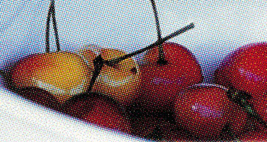

# MoireRemover (Auto)

Плагин для Adobe Photoshop, который одним нажатием убирает муар со сканов
старых фотографий, напечатанных на матовой фотобумаге — и точечный/цветной
муар от растровой печати, и равномерную нецветную фактуру самой бумаги
(мелкий рельеф вроде наждачной бумаги). Работает полностью автоматически:
никаких ручных выделений точек в спектре, как в классических FFT/IFFT
плагинах.

<p align="center">
  
  &nbsp;&nbsp;
  
</p>
<p align="center"><i>Слева — исходный скан с муаром, справа — результат работы плагина.</i></p>

## Зачем это нужно

Матовая фотобумага имеет собственную микро-рельефную текстуру. При
сканировании эта текстура накладывается на регулярную сетку пикселей
сканера и даёт классическую интерференционную сетку — муар. Раньше для
её удаления использовался старый ручной плагин FFT/IFFT: нужно было
запускать прямое FFT-преобразование, вручную стирать ластиком "звёзды"
шумных частот в спектре, запускать обратное IFFT, а затем ещё и вручную
возвращать цвет через смешение слоёв, потому что классический FFT/IFFT
отдаёт только чёрно-белый результат. Это долго, легко забыть порядок
действий, и результат сильно зависит от аккуратности рук.

MoireRemover делает то же самое, но сам: сам анализирует спектр, сам
решает, какие частоты — муар, а какие — настоящая картинка, сам
подавляет нужное, сам собирает изображение обратно с исходным цветом.
Никакой ручной работы с частотами.

## Как это работает

Технически это CEP-расширение (панель на HTML/JS + скрипт на
ExtendScript для общения с Photoshop), а не новый формат UXP — благодаря
этому оно ставится простым копированием папки, без Creative Cloud и без
подписи расширения.

Когда вы нажимаете кнопку в панели:

1. Проверяется, что активный слой — это самый верхний слой документа.
2. Слой экспортируется во временный PNG.
3. Изображение переводится в цветовое пространство YCbCr, обработке
   подвергается только яркостный канал (Y) — поэтому цвета никогда не
   плывут.
4. Считается прямое 2D FFT-преобразование (реализация Cooley-Tukey,
   написана с нуля, без внешних библиотек).
5. По спектру работают два независимых детектора:
   - **Точечный детектор** — ищет резкие одиночные всплески на фоне
     собственного локального среднего по кругу того же радиуса. Это
     классический сеточный муар растровой печати и цветной шум.
   - **Кольцевой детектор** — ищет равномерно повышенную кольцевую
     область в спектре (не единичные точки, а целый диапазон радиусов).
     Использует медиану по кругу, а не среднее — это специально сделано
     так, чтобы обычные резкие прямые края на фото (которые тоже дают
     всплеск в спектре, но только в 1-2 направлениях) не принимались за
     круговую текстуру бумаги. Также кольцевой детектор никогда не
     трогает низкие частоты — там живёт общая композиция кадра, а не
     мелкая фактура.
6. Найденные частоты гасятся гауссовым notch-фильтром (не до нуля, а до
   уровня локального фона — это мягче и не даёт резких артефактов).
7. Считается обратное FFT, изображение собирается обратно с исходным
   цветом.
8. Результат кладётся **новым слоем сверху** — исходный слой не
   изменяется никогда. Не понравился результат — удалите слой или
   уменьшите непрозрачность.

Прогресс-бар в панели показывает этапы (для больших сканов обработка
может занять от нескольких секунд до пары минут — вся математика
считается прямо в панели, без внешних программ и без сети).

## Установка

**Вариант 1 — установщик.** Скачайте `MoireRemover_Setup.exe` из
[Releases](../../releases), запустите и следуйте подсказкам.

**Вариант 2 — вручную (обязателен для macOS, подходит и для Windows).**

Классический CEP ставится копированием папки — Creative Cloud и
подписанное расширение не нужны, работает независимо от способа
активации Photoshop.

1. Включите режим разработчика Photoshop (иначе он не загрузит
   неподписанное расширение):
   - **Windows** — `regedit`, раздел `HKEY_CURRENT_USER\Software\Adobe`.
     В подразделах `CSXS.9`, `CSXS.10`, `CSXS.11` (создайте, если их
     нет) добавьте строковый параметр `PlayerDebugMode` со значением `1`.
   - **macOS** — в Terminal:
     ```
     defaults write com.adobe.CSXS.9 PlayerDebugMode 1
     defaults write com.adobe.CSXS.10 PlayerDebugMode 1
     defaults write com.adobe.CSXS.11 PlayerDebugMode 1
     ```
2. Скопируйте папку `MoireRemover` целиком в:
   - Windows: `%APPDATA%\Adobe\CEP\extensions\`
   - macOS: `~/Library/Application Support/Adobe/CEP/extensions/`
3. Перезапустите Photoshop и откройте `Window ▸ Extensions ▸ Moire
   Remover (Auto)`.

Подробный разбор проблем с установкой — в `README.txt` внутри папки
плагина.

**Требования:** Adobe Photoshop 2018 (19.0) и новее, Windows или macOS.

## Использование

1. Откройте скан в Photoshop.
2. Сделайте активным слой, который нужно очистить от муара — он должен
   быть самым верхним слоем в стопке.
3. Нажмите «Убрать муар».
4. Дождитесь прогресс-бара. Сверху появится новый слой с результатом.

## Настройки

Всё в блоке «Дополнительные настройки» панели — по умолчанию трогать не
обязательно, плагин рассчитан на работу «в один клик».

| Настройка | По умолчанию | Что делает |
|---|---|---|
| Убирать фактуру бумаги | включено | Отдельный, более мягкий фильтр для равномерной мелкой фактуры (рельеф бумаги), которая размазана по всей площади, а не выглядит резкой сеткой |
| Порог фактуры | 2.5 дБ | Насколько сильно кольцевая область должна выделяться, чтобы считаться фактурой бумаги. Меньше — агрессивнее |
| Чувствительность | 6.0 | То же самое, но для точечного (сеточного/цветного) муара. Меньше — агрессивнее |
| Радиус подавления | 6 px | Насколько широко гасится каждая найденная точка спектра. Не делайте меньше 4-5 без причины — на плотной печатной текстуре слишком узкий радиус может сам оставить на однотонном фоне слабые новые полосы |

Для очень сильной и контрастной текстуры (например, явное холщовое
плетение, а не тонкий рельеф бумаги) одного ползунка обычно мало —
двигайте порог фактуры вниз, чувствительность вниз и радиус подавления
вверх одновременно.

## Честно об ограничениях

- Обработка идёт в 8 бит на канал (слой экспортируется во временный
  PNG) — в отличие от классических нативных C-плагинов, которые могут
  работать прямо в 16-битном конвейере Photoshop. Для реставрации в
  высокой битности это стоит иметь в виду.
- Автоматическое распознавание — это статистическая эвристика, а не
  идеальный алгоритм. На большинстве сканов срабатывает без ручной
  настройки, но для нестандартных или экстремально сильных текстур
  может потребоваться подвинуть ползунки (см. выше).
- Кольцевой детектор в теории может слегка смягчить настоящую
  повторяющуюся деталь на самом фото (плетение ткани, рябь на воде) —
  спектрально это иногда неотличимо от фактуры бумаги. Встречается
  редко, эффект небольшой; при необходимости — снизьте порог фактуры
  или отключите фильтр для конкретного фото.
- Проверено на синтетических тестах и на реальных сканах в процессе
  разработки — но не на большой выборке снимков, в отличие от
  классического FFT/IFFT-подхода, которым сообщество пользуется больше
  15 лет.

## Чем отличается от классического FFT/IFFT плагина

Главное отличие — автоматизация. Классический подход (Chirokov FFT/IFFT
и его форки вроде Joofa FFT, Ft Pattern Suppressor) требует вручную
стирать шумные точки в спектре при каждом запуске и вручную
восстанавливать цвет через смешение слоёв — по признанию авторов даже
самых свежих автоматизированных надстроек над этим плагином, снятие
подавления с центральной "звезды" спектра вручную до конца
автоматизировать не вышло. MoireRemover не требует ручной работы с
частотами вообще, сохраняет цвет автоматически и работает
неразрушающим слоем. При этом по сырому качеству обработки на большой
выборке разных изображений и по работе в высокой битности классический,
десятилетиями обкатанный нативный подход всё ещё может иметь
преимущество — на этот счёт иллюзий нет.

## Структура проекта

```
MoireRemover/
├── CSXS/
│   └── manifest.xml       — манифест CEP-расширения
├── client/
│   ├── index.html         — интерфейс панели
│   ├── style.css           — оформление (тёмная тема под Photoshop)
│   ├── index.js            — логика панели, связь с Photoshop
│   ├── fft.js               — своя реализация 2D FFT (Cooley-Tukey)
│   └── moire.js             — детекторы муара/фактуры и notch-подавление
├── jsx/
│   └── hostscript.jsx      — ExtendScript: экспорт/импорт слоя
└── README.txt              — подробная инструкция по установке и использованию
```

## Связь

По вопросам и багам плагина: **tidesluck@icloud.com**
(эта же почта указана прямо в панели плагина в Photoshop).
